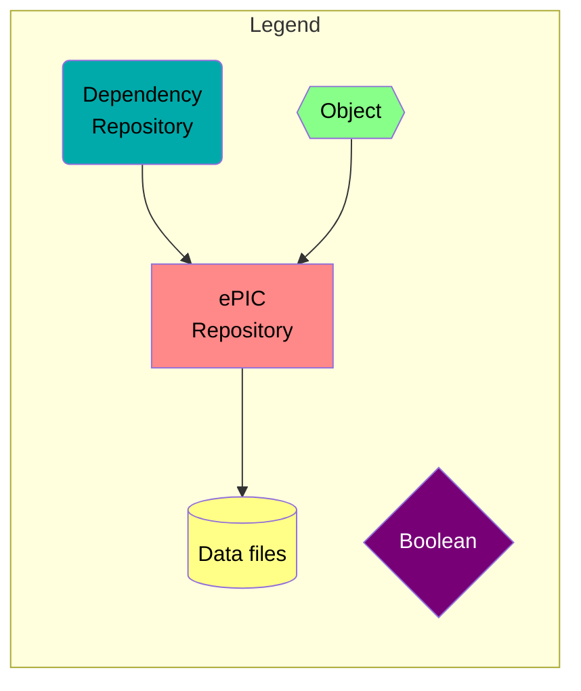
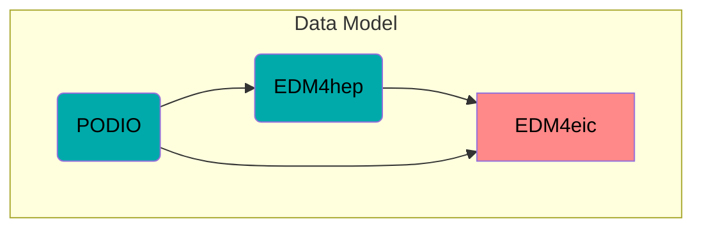

# dRICH-dev
Resources and Tools for EPIC dRICH development

| **Table of Contents**               |                                                       |
| --:                                 | ---                                                   |
| [Setup](#setup)                     | How to download and build the code                    |
| [ePIC Software Stack](#flowchart)   | Flowchart of ePIC Software and Dependency             |
| [Geometry and Materials](#geometry) | Detector geometry and material properties description |
| [Simulation](#simulation)           | Running the simulation in Geant4                      |
| [Reconstruction](#reconstruction)   | Running the reconstruction algorithms                 |
| [Benchmarks](#benchmarks)           | Running the analysis benchmarks and performance plots |
| [Miscellaneous](#miscellaneous)     | Additional code for support                           |

| **Documentation Links**                                 |                                               |
| --:                                                     | ---                                           |
| [Links](doc/links.md)                                   | Collection of dRICH Software and Resources    |
| [Branches and Pull Requests](doc/branches.md)           | Active development branches and pull requests |
| [Project Board](https://github.com/orgs/eic/projects/4) | Issues and Pull Request Tracking              |
| [Material Properties](doc/material_tables.md)           | Generation of Material Property Tables        |

## Notes
EPIC Software is modular: see [the flowchart below](#flowchart) for
general guidance of the modules relevant for RICH development. It shows their
dependences, calls, and data flow.

See also [the collection of links](doc/links.md) to various resources and dRICH
implementations.

## Active Branches

Depending on the development, you likely need to change `git` branches for some
of the modules. See the [active branches tables](doc/branches.md) for tables
of branches for varying configurations.

## Notes for ATHENA
- This repository was used for development of the ATHENA dRICH and pfRICH; it
  has since been modified to support EPIC
- See [doc/athena.md](doc/athena.md) for guidance how to run using the ATHENA geometry;
  this is temporarily supported for helping test reconstruction algorithms
- See [doc/athena-branches.md](doc/athena-branches.md) for information about the
  development branches and pull requests that were used for the ATHENA proposal

---

<a name="setup"></a>
# Setup
- First, clone this `drich-dev` repository
  - If you follow the directions below as is, everything will be installed in
    subdirectories of this repository; you will need a few GB of disk space
  - If you have experience with the ATHENA software stack, you may prefer your
    own set up; in that case, make symlinks to your local `git` repository
    clones, so you can use the scripts in this directory
- Obtain the EIC Software image (`jug_xl`):
  - follow [ePIC Software Tutorials](https://indico.bnl.gov/category/443/)
    to obtain the EIC software image
    - the `eic-shell` script is used to start a container shell
    - all documentation below assumes you are running in `eic-shell`
    - this image contains all the dependencies needed for EPIC simulations
      - tip: when in a container shell (`eic-shell`), see `/usr/local` or `/opt/software/linux.../gcc.../`
        for the installed software
        - for example, if you want to check exactly what is available in the
          [EDM4hep data model](https://github.com/key4hep/EDM4hep), see the headers
          in `/opt/software/linux.../gcc.../edm4hep.../include/edm4hep/` (these are
          produced by the [edm4hep.yaml](https://github.com/key4hep/EDM4hep/blob/master/edm4hep.yaml)
          configuration file)
    - be sure to regularly update your image by running `eic-shell --upgrade`; this is necessary
      to keep up with upstream changes, such as in EDM4hep or DD4hep
- Obtain EPIC Software modules, either clone or symlink the repositories to the
  specified paths:
  - Modules:
    - [`epic`](https://github.com/eic/epic) to `./epic`, for the EPIC detector geometry,
      based on [DD4hep](https://github.com/AIDASoft/DD4hep)
    - [`irt`](https://github.com/eic/irt) to `./irt`, for the Indirect Ray Tracing for RICH reconstruction
    - [`EDM4eic`](https://github.com/eic/EDM4eic) to `./EDM4eic`, for the data model; this extends
      [`EDM4hep`](https://github.com/key4hep/EDM4hep), the common data model, which is included
      in the EIC software image
    - [`EICRecon`](https://github.com/eic/EICrecon) to `./EICrecon`, for the reconstruction framework
    - [`reconstruction_benchmarks`](https://eicweb.phy.anl.gov/EIC/benchmarks/reconstruction_benchmarks) to
      `./reconstruction_benchmarks`, for the reconstruction benchmarks and performance studies
  - Cloning:
    - Only clone the repositories that you need or intend to modify; they are all installed in the `eic-shell`
      image, but if you want to build the latest possible version of a repository, clone it; `drich-dev` is
      designed to _override_ `eic-shell` image builds
    - Clone the Github repositories with SSH, which is required for
      contributions (you must be a member of the EIC organization and ePIC Devs
      team), otherwise you need to clone with HTTPS (or fork and clone the fork
      with SSH)
      - SSH clone:
        ```bash
        git clone git@github.com:eic/epic.git
        git clone git@github.com:eic/irt.git
        git clone git@github.com:eic/EDM4eic.git
        git clone git@github.com:eic/EICrecon.git
        ```
      - HTTPS clone:
        ```bash
        git clone https://github.com/eic/epic.git
        git clone https://github.com/eic/irt.git
        git clone https://github.com/eic/EDM4eic.git
        git clone https://github.com/eic/EICrecon.git
        ```
    - Some repositories are still hosted on [EICweb](https://eicweb.phy.anl.gov/EIC); if you want to contribute
      to them, you will also need an account there. Again, if you have access, clone with SSH, otherwise clone
      with HTTPS:
      - SSH clone:
        ```bash
        git clone git@eicweb.phy.anl.gov:EIC/benchmarks/reconstruction_benchmarks.git
        ```
      - HTTPS clone:
        ```bash
        git clone https://eicweb.phy.anl.gov/EIC/benchmarks/reconstruction_benchmarks.git
        ```
  - Checkout the appropriate branches of each repository, depending on your needs
    - see [Branches and Pull Requests](doc/branches.md)
    - see also the [project page](https://github.com/orgs/eic/projects/4/views/1)
      for more up-to-date information
  - Follow directions below to build each module

## Environment
- execute `source environ.sh`
  - this file contains several environment variables needed by many scripts;
    it is recommended to read through `environ.sh` and make any changes as
    needed
  - `$BUILD_NPROC` is the number of parallel threads used for multi-threaded
    building and running multi-threaded
    - change it, if you prefer
    - memory-hungry builds will be built single-threaded
  - `$EIC_SHELL_PREFIX` is the main directory where module builds will be installed
    - `environ.sh` will change this to `./prefix`, so that all module builds
      will be installed locally
    - change it, if you prefer a different directory
  - you can find documentation for many other variables in the corresponding
    module repositories
  - there are some additional "comfort" settings, which depend on your host
    environment; it is not required to use these, but feel free to add your own
    - if `~/bin` exists, it will be added to your `$PATH`

## Building Modules
- you must be in the EIC container (`eic-shell`) and have environment
  variables set (`source environ.sh`)
- build each repository, one-by-one, in order of dependences
  - build scripts, in recommended order:
  ```bash
  ./build.sh EDM4eic
  ./build.sh irt
  ./build.sh epic
  ./build.sh EICrecon
  ./build.sh reconstruction_benchmarks
  ```
  - you could also run `./rebuild_all.sh` to (re)build all of the modules in the
    recommended order
- run `source environ.sh` again, if:
  - if this is your first time building, or a clean build
  - if a module's environment has been updated, in particular `epic/templates/setup.sh.in`
- finally, build the local `drich-dev` code:
  ```bash
  make         # build and install the code
  make clean   # remove built targets (only if you want to recompile from scratch)
  ```
  - this will produce several executables in `bin/` from code in `src/`

### Recommendations and Troubleshooting
- be mindful of the environment variables
  - if in doubt, run `source environ.sh` to update all of them
  - inspect all of the printed environment variables
- execute `./rebuild_all.sh` to quickly rebuild all repositories, in order of
  dependences; this is useful when you switch branches in *any* of the
  repositories, or if you pull in updates
  - sometimes things will break, simply because a dependent module is out of
    date; in that case, make sure all repositories are as up-to-date as
    possible; you may also need to update your Singularity/Docker image
    (`eic-shell --upgrade`)
- be mindful of which branch you are on in each repository, especially if you
  have several active pull requests
  - for example, `irt` requires the new `EDM4eic` components and datatypes, which
    at the time of writing this have not been merged to `EDM4eic` `main`
  - use `./check_branches.sh` to quickly check which branches you are on in all
    repositories
  - use `./check_status.sh` to run `git status` in each repository, which is
    useful during active development
- for clean builds, you can generally pass the word `clean` to any build script
  (you can also do `./rebuild_all.sh clean` to clean-build everything)
- most build scripts will run `cmake --build` multi-threaded
  - the `$BUILD_NPROC` environment variable should be set to the number of
    parellel threads you want to build with (see `environ.sh`)

---

<a name="flowchart"></a>
# ePIC Software Stack
This is a flowchart showing the ePIC Software Stack, dependencies, and data flow, with some focus
on parts specific for the dRICH. This `drich-dev` repository uses all of these, and in many cases,
wraps functionality in dRICH-specific code stored here in `drich-dev`.





```mermaid
flowchart TB
  classDef epic fill:#ff8888,color:black
  classDef dep fill:#00aaaa,color:black
  classDef obj fill:#88ff88,color:black
  classDef data fill:#ffff88,color:black
  classDef op fill:#770077,color:white

  subgraph Event Generation
    Pythia6(Pythia6):::dep
    Pythia8(Pythia8):::dep
    OtherGen(etc.):::dep
    Hepmc[(HEPMC files)]:::data
    Gun(Particle Guns<br/>ddsim OR npsim):::dep
    GenOR{OR}:::op
  end
  Pythia6  --> Hepmc
  Pythia8  --> Hepmc
  OtherGen --> Hepmc
  Hepmc    --> GenOR
  Gun      --> GenOR

  subgraph Simulation
    DD4hep(DD4hep):::dep
    Geant(Geant4):::dep
  end
  Geant --> DD4hep

  subgraph Geometry
    Epic[epic]:::epic
    subgraph Compact Files
      DDCompact{{Compact files}}:::obj
      DDMat{{Material Properties}}:::obj
    end
    DDPlugin{{Geometry Plugins}}:::obj
  end
  SimOut[(Simulation Output<br/>edm4hep ROOT files)]:::data
  DD4hep    --> Gun
  GenOR     --> Epic
  DD4hep    --> Epic
  DDCompact --> Epic
  DDPlugin  --> Epic
  DDMat     --> Epic
  Epic      --> SimOut

  subgraph Reconstruction Framework
    JANA(JANA2):::dep
    EICreconPlugins{{EICrecon<br/>Plugins}}:::obj
    EICreconFactories{{EICrecon<br/>Factories}}:::obj
    EICreconServices{{EICrecon<br/>Services}}:::obj
    EICrecon[EICrecon]:::epic
  end
  subgraph Reconstruction Algorithms
    IRT[irt]:::epic
    RecoAlgorithms{{Reconstruction<br/>Algorithms}}:::obj
    RecoAlgorithmConfigs{{Algorithm<br/>Configurations}}:::obj
  end
  RecOut[(Reconstruction Output<br/>edm4hep ROOT files)]:::data
  SimOut               ----> "Reconstruction Framework"
  EICreconServices     -->  EICreconFactories
  EICreconFactories    -->  EICrecon
  EICreconPlugins      -->  EICrecon
  IRT                  -->  EICreconServices
  IRT                  -->  RecoAlgorithms
  RecoAlgorithms       --->  EICreconFactories
  RecoAlgorithmConfigs -->  RecoAlgorithms
  EICreconFactories    --->  RecoAlgorithmConfigs
  JANA                 -->  EICrecon
  EICrecon         -->  RecOut

  subgraph Benchmarks
    PhysicsBenchmarks[physics_benchmarks]:::epic
    DetectorBenchmarks[detector_benchmarks]:::epic
    ReconstructionBenchmarks[reconstruction_benchmarks]:::epic
  end
  AnaOut[(Reconstruction Analysis<br/>ROOT files)]:::data
  SimOut --> DetectorBenchmarks
  RecOut --> PhysicsBenchmarks
  RecOut --> ReconstructionBenchmarks --> AnaOut

```


---

<a name="geometry"></a>
# Geometry and Materials
- the geometry and materials are implemented in DD4hep, in the
  [epic](https://github.com/eic/epic) repository
  - see the [DD4hep class index](https://dd4hep.web.cern.ch/dd4hep/reference/)
    or the [homepage](https://dd4hep.web.cern.ch/dd4hep/) for documentation
  - the following files in `epic/` are relevant for the dRICH:
    - `compact/drich.xml`: the compact file for the dRICH
      - constants for the geometry (e.g., dimensions, positions)
      - see `compact/definitions.xml` for main constants (for the full detector),
        such as global positioning
      - use `./search_compact_params.sh [PATTERN]` to quickly obtain the
        *numerical* value of any constant, where `[PATTERN]` is case sensitive
        (e.g., `./search_compact_params.sh DRICH`); this is a script in
        `drich-dev` which wraps `npdet_info`
      - see `comment` tags for details of all parameters
    - `compact/optical_materials.xml` for surface and material property tables,
      such as refractive index
      - property tables relevant for the dRICH can be generated by following 
        [doc/material_tables.md](doc/material_tables.md)
      - see `compact/materials.xml` for material definitions and
        `compact/elements.xml` for elements
      - materials and parameterizations relevent for the dRICH contain the
        substring `DRICH` in their name
      - materials etc. are referenced by name in `compact/drich.xml`
    - the full detector compact file is `$DETECTOR_PATH/epic.xml`, which is generated via
      Jinja during `cmake` (run `build.sh epic`), along with a dRICH-only
      compact file `$DETECTOR_PATH/epic_drich_only.xml`
      - these compact files are used by many scripts, such as `npsim`, whereas
        `compact/drich.xml` is *only* for the dRICH implementation itself
      - `build.sh epic` (`cmake`) will also copy local `epic/compact/*.xml`
        files to `$DETECTOR_PATH`, since the generated compact files (`$DETECTOR_PATH/epic*.xml`) 
        reference compact files in `$DETECTOR_PATH`
    - `src/DRICH_geo.cpp` is the C++ source file for the dRICH
      - relies on constants from the compact files
      - builds the dRICH
      - placement algorithms
      - parameterizations (e.g., of the mirrors)
      - see comments within the code for documentation

## Viewing the Geometry and Parameter Values
- run `./geometry.sh` to produce the `TGeo` geometry ROOT file
  - follow the usage guide to specify whether to draw the full EPIC
    detector, or just the dRICH
  - output ROOT file will be in `geo/`, by default
- open the resulting ROOT file in `jsroot` geoviewer, using either:
  - [CERN host](https://root.cern/js/) (recommended)
  - Local host (advanced, but offers better control) - see [setup guide](doc/jsroot.md)
  - [ANL hosted](https://eic.phy.anl.gov/geoviewer/)
- browse the ROOT file geometry tree in the sidebar on the left:
  ```
  detector_geometry.root
  └── default
      └── world_volume
          ├── ...
          ├── DRICH
          └── ...
  ```
  - right click on the desired component, then click `Draw`
  - the default projection is perspective, but if you need to check alignment,
    change to orthographic projection:
    - right click -> show controls -> advanced -> orthographic camera
    - square your browser window aspect ratio, since the default aspect ratio is
      whatever your browser window is
  - more documentation found on [jsroot website](https://root.cern/js/)
- check for overlaps
  - typically more efficient to let the CI do this (in `epic`)
  - call `./overlap_check.sh` to run a local check
    - one check faster and less accurate, the other is slower and more accurate
- use `./search_compact_params.sh [PATTERN]` to quickly obtain the value of any
  parameter in the compact files, rather than trying to "reverse" the formulas
  - for example, `./search_compact_params.sh DRICH` to get all dRICH variables
  - the search pattern is case sensitive
  - this script is just a wrapper for `npdet_info`, run `npdet_info -h` for
    further guidance
- use `dawn.sh` to generate a PNG file showing a cross section of all detectors

## GDML Output
- currently we use the CI for this, from the `epic` repository
  (the `athena` repository has a dRICH specific GDML output CI job, but at the
  time of writing this, this automation is not yet present in `epic` CI)
- TODO: add a local script to automate connection to Fun4all

---

<a name="simulation"></a>
# Simulation
There are some local scripts to aid in simulation development. All compilable
`src/.cpp` programs are compiled by running `make`, which will build
corresponding executables and install them to `bin/`

- `simulate.py`: runs `npsim` with settings for the dRICH and pfRICH
  - run with no arguments for usage guidance
  - `npsim` is the main script for running Geant4 simulations with DD4hep; it
    wraps DD4hep's `ddsim` with some extra settings for Cherenkov detectors,
    such as the sensitive detector action
  - basically copied to `reconstruction_benchmarks`, but stored here as well for
    backup
- example simulation analysis code is found in `src/examples`
  - see comments within each for more details
  - build with `make` (from the top-level directory); the corresponding executables
    will be installed to `bin/`
- `src/draw_hits.cpp` (run with `bin/draw_hits`)
  - reads simulation output and draws raw hit positions and number of hits vs.
    momentum
  - build with `make`, execute as `bin/draw_hits [simulation_output_file]`
- `src/event_display.cpp` (run with `bin/event_display`)
  - reads simulation output and draws the hits within sensor pixels, which is
    useful for checking mapping of sensor segmentation (pixels)

## Automated Parameter Variation
- use `scripts/vary_params.rb` to run simulation jobs while varying dRICH compact file parameters
  - Ruby gems (dependencies) are required to run this; see [doc/ruby.md](doc/ruby.md) for guidance
  - The input of this script is a configuration file, written as a class
    - This file includes:
      - Which parameters to vary, and how
      - Pipelines: shell commands to run on each variant, for example, `simulate.py`
    - See `ruby/variator/template.rb` for an example and more details
      - The class `Variator` inherits from the common superclass `VariatorBase`
      - Add your own `Variator` class in another file, then specify this file
        when you call `vary_params.rb`, so that it will use your `Variator` class
        rather than the default
    - The script runs multi-threaded: one thread per variant
      - Output `stdout` and `stderr` are logged, along with your shell command pipelines

---

<a name="reconstruction"></a>
# Reconstruction

## IRT: Indirect Ray Tracing

To use reconstruction with IRT, you must be on the correct set of branches. See
the [tables of branches](doc/branches.md) for guidance.

### EICrecon

The EICrecon version will be better documented later, when at least a basic
version is merged to `main`, but in the meantime, see
[the README in EICrecon](https://github.com/eic/EICrecon/tree/main/src/detectors/DRICH)
(if you see nothing there, change to the appropriate branch).

To run the reconstruction with EICrecon:
```bash
recon.rb -h  # see usage guide (run with no arguments to run with defaults)
```

There are various configuration files available in `config/`, which depends on which branch
of EICrecon you are currently on.

### Juggler

The [`juggler`](https://eicweb.phy.anl.gov/EIC/juggler) implementation was used
for ATHENA, and was supported for EPIC until the migration to `EICrecon` was
complete; `juggler` is now **deprecated**, but this section contains documentation
how to run it, in case it is needed.

- Clone it to `.juggler/`; since `juggler` is hosted on EICweb and is
  deprecated, it is recommended to clone with HTTPS:
  ```bash
  git clone https://eicweb.phy.anl.gov/EIC/juggler.git
  ```
  Then `checkout` the appropriate development branch.
- Create the auxiliary IRT configuration file; this is a ROOT file containing `libIRT`
  objects, such as optical boundaries, based on the dRICH geometry description.
```bash
bin/create_irt_auxfile
```
- Note: the creation of this auxiliary file requires `EICrecon` to be cloned locally, but it does
  not need to be compiled

- Then call `juggler` or the old code:
```bash
juggler.sh -d -j   # to use Juggler (IRTAlgorithm), with the dRICH
juggler.sh -d -r   # to use standalone reader (irt/scripts/reader*.C), with the dRICH
juggler.sh         # for usage guide, such as how to specify input/output files
```

- Run the evaluation code (use `-h` for usage):
```bash
evaluate.sh
```


---

<a name="benchmarks"></a>
# Benchmarks

The benchmarks run downstream of all other modules, and are useful for running
tests. For example, automated checks of upstream geometry changes, to see what
happens to performance plots.

- obtain and build the `reconstruction_benchmarks` repository (see above)
- run `benchmark.rb` (a symlink to the main benchmark runner script) with no arguments
  to see the usage guide

## `drich-dev` Continuous Integration (CI)

`drich-dev` includes a CI workflow, for rapid testing of changes to the ePIC dRICH
- The CI workflow is triggered on every commit to a branch with an associated pull request
- The workflow includes:
  - Build tests: all modules are built in order of dependence
  - Pipeline: simulation, reconstruction, benchmarks, plus some other local executables
    from `drich-dev`
  - Geometry generation: generate `TGeo` files and tables of constants
  - See [workflow file](.github/workflows/ci.yml) for more details
- Edit [`scripts/configure_CI.sh`](scripts/configure_CI.sh) to select which branch each
  module should be on
  - this is useful if you have made changes to more than one repository
  - this _complements_ the CI workflows on each module, allowing dRICH developers to test the full
    simulation-reconstruction-benchmarks pipeline on any custom combination of `git` branches

---

<a name="miscellaneous"></a>
# Miscellaneous
- the `math/` directory contains scripts and Mathematica notebooks used to
  perform miscellaneous calculations; many are "once and done" and don't really
  need to be implemented in the source code
- the `scripts/` directory contains all other miscellaneous scripts; 
  - some scripts are in Ruby; follow [this guide](doc/ruby.md) to install gems
  (dependencies)
- `deprecated/` contains some old scripts which may also be helpful

## Upstream Development Support
This section contains notes for building upstream repositories. Clone the repositories
that you want to test to this top-level directory. The general build procedure is:
```bash
source environ.sh
build.sh DD4hep
source scripts/this_DD4hep.sh
build.sh NPDet
source scripts/this_NPDet.sh  # note: you may prefer to directly call scripts in NPDet/install/bin
rebuild_all.sh
```
Only build these repositories if you want to override the versions installed in
`eic-shell`. To revert back to the `eic-shell` versions, restart your
`eic-shell` instance and run `source environ.sh`; you may also need to run
`rebuild_all.sh` (or `rebuild_all.sh clean`).
