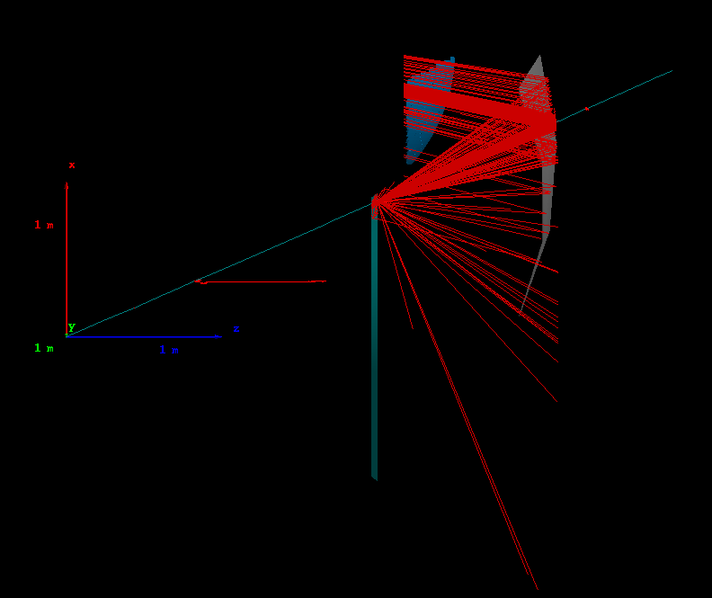
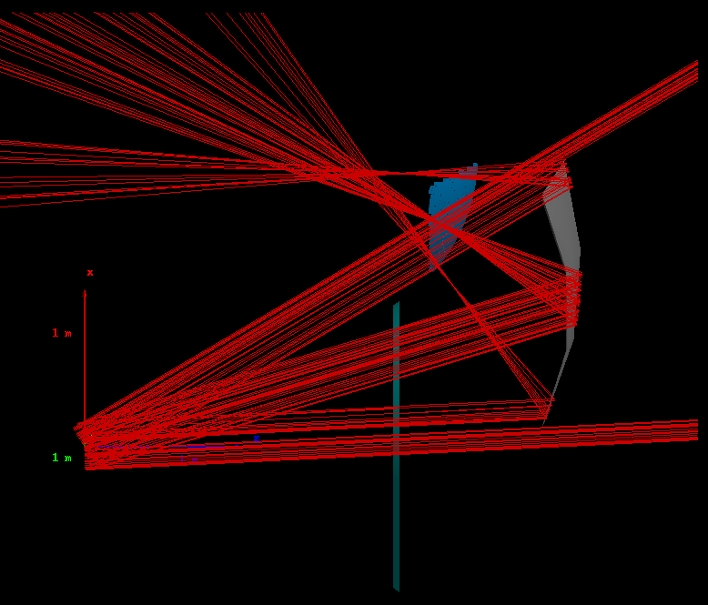
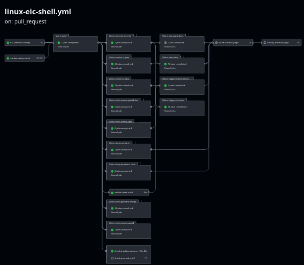
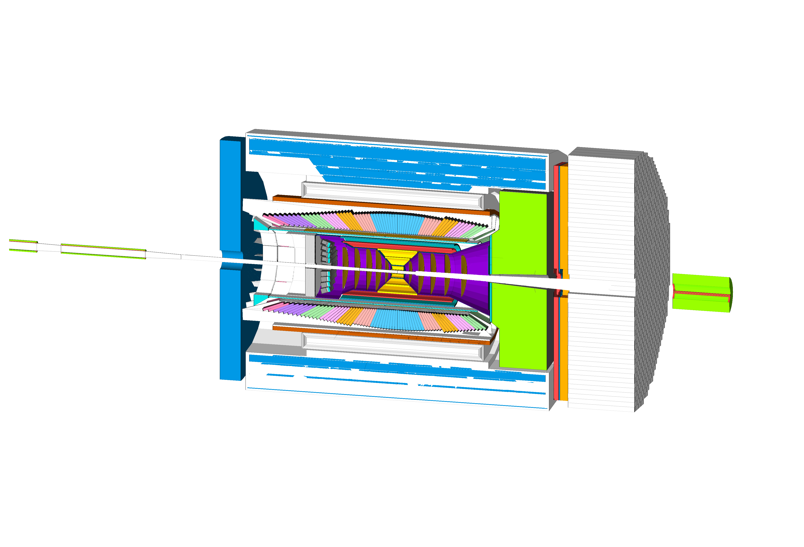
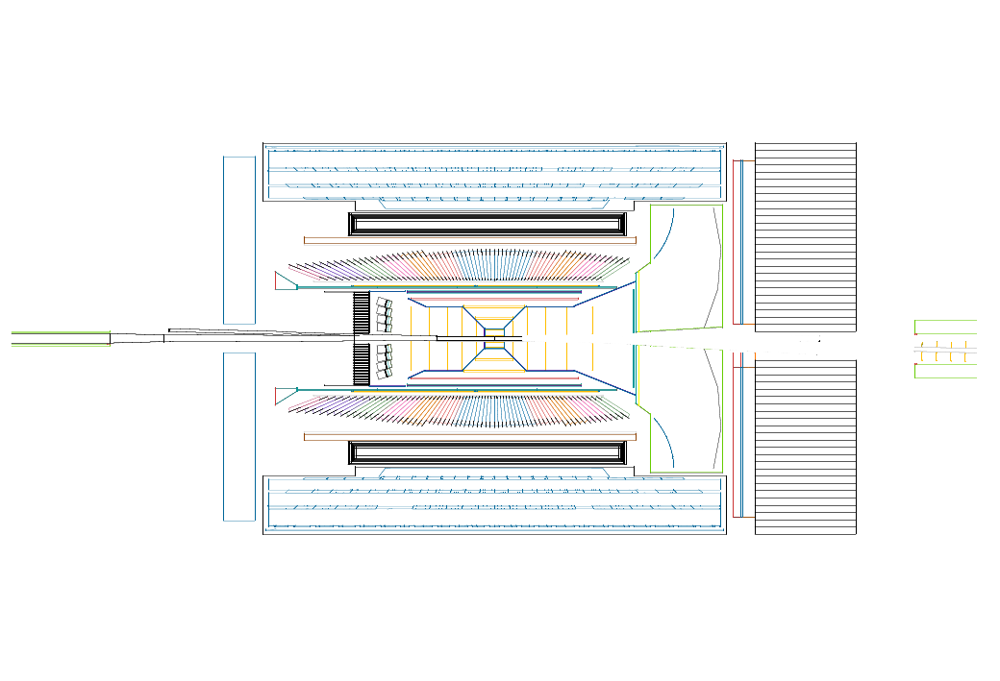

Tutorial 2: dRICH Visualization, Continuous Integration, and Geometry Code
==========================================================================

- [TUTORIAL RECORDING](https://duke.zoom.us/rec/play/xAzADPjS_bA5_LckU3kaz0BeDsqGjYen9gNpMZmndzfBAooVWlqEWwAfcSH5DzSlVrshzgrsacYhXOxJ._MoPSIDg0lOCl8Oj?canPlayFromShare=true&from=share_recording_detail&continueMode=true&componentName=rec-play&originRequestUrl=https%3A%2F%2Fduke.zoom.us%2Frec%2Fshare%2FYpwfjg8auzo6TYinWF_HVfeCK_Nbr3FmCwGc7p6xInEXr9GtZVR80scgS5_cZHn6.UxyKJKSFjAhADicc)
- [Return to Tutorial Landing Page](README.md)

## Visualization

### Event Visualization

To visualize the charged particle and photon paths, [try following the event visualization tutorial](https://indico.bnl.gov/event/18360/). Unfortunately, this procedure does not work for all graphics cards and we have been unable to test this for the dRICH.

As an alternative, the non-interactive visual from Geant4 may work on a broader range of hardware. To use this, first rebuild the dRICH geometry with one sector only (to make it easier to visualize). Change the geometry constant `DRICH_debug_sector` from `0` to `1`, as [defined in `epic/compact/pid/drich.xml`](https://github.com/eic/epic/blob/d14e80b98cc51fb7acf014f6984caf8fe347aed1/compact/pid/drich.xml#L46). Open the compact file:
```bash
nano epic/compact/pid/drich.xml  # or your preferred text editor; you may need to do this outside of 'eic-shell'
```
Change the line
```xml
<constant name="DRICH_debug_sector"    value="0"/>
```
to
```xml
<constant name="DRICH_debug_sector"    value="1"/>
```
Save and quit; if using `nano`, press `^X`, then `y`, then `enter`. Now rebuild `epic`:
```bash
build.sh epic
```
You can confirm only one sector is drawn by running `geometry.sh` as before.

Now run `simulate.py` in visual mode (`-v`). Let's throw only one pion at the dRICH using test 1:
```bash
simulate.py -t1 -n1 -v
```
A static image will appear, showing the thrown pion and corresponding Cherenkov photons. This is a top view of a single sector; edit `simulate.py` to change the view angle. Your shell will be in a Geant4 prompt; type `exit` and press Enter to exit.



When you are done, revert the changes in `epic/compact/pid/drich.xml` so that `DRICH_debug_sector` is set to `0`, then rebuild `epic`.

### Optics Studies

Some tests in `simulate.py` are used for optical studies. In particular, test 12 sends wide, collimated photon beams from the IP at varying angles aimed at the mirror. The focus of each beam is the parallel-to-point focal region, and tends to be consistent with where the best Cherenkov ring resolution is found. As suggested by the `simulate.py` usage guide, set `DRICH_debug_optics` to `1`. In `epic/compact/pid/drich.xml`, change the line
```xml
<constant name="DRICH_debug_optics"    value="0"/>
```
to
```xml
<constant name="DRICH_debug_optics"    value="1"/>
```
and rebuild `epic`:
```bash
build.sh epic
```
Now run test 12:
```bash
simulate.py -t12
```
Use the `-n` option to change the number of photons per beam, and the `-k` option to change the number of beams. For example,
```bash
simulate.py -t12 -k3 -n30
```



As before, type `exit` and press Enter to exit the Geant4 prompt.
When you are done, revert the changes in `epic/compact/pid/drich.xml` so that `DRICH_debug_optics` is set to `0`, then rebuild `epic`.

_Exercise_: edit `epic/compact/pid/drich.xml` to try to move around some components of the dRICH. Rebuild `epic` and check the geometry to see what moved. Then re-check the distribution of hits in the event display as well as the parallel-to-point focal region. Can you improve the ring resolution?


### Necessary Digression: Continuous Integration

All ePIC software repositories include Continuous Integration (CI) workflows. These workflows are triggered automatically for every `git commit` on a branch associated with a Pull Request (PR). For example, [see this PR](https://github.com/eic/epic/pull/445).
- The 'Checks' tab shows the latest CI workflow run on this PR's branch; the main 'Actions' tab at the top of the page lists all of the CI workflows that are running and have run, for all PRs
- After clicking the 'Checks' tab on the PR, click on `linux-eic-shell` on the left; this is the primary workflow
  - _Exercise:_ can you also get here from the 'Actions' tab? Knowing how to do this will let you see any CI workflow, for example, the latest CI workflow that ran on the `main` branch, which happens when a PR gets merged. CI workflows on `main` give an indication of the "health" of a repository, since all work stems from `main`
- At the top you will see a diagram of the workflow jobs, such as:
  - `build`: compiles the `epic` code
  - `convert-to-gdml`: converts all subsystems to `GDML` files
  - `check-overlap`: checks for overlaps in the geometry
  - `dawn-view`: generates `DAWN` views of the geometry



- Below the workflow diagram, you will find a list of "Artifacts"; these are the products of a CI workflow, such as:
  - `gdml`: the resulting `GDML` files
  - `tgeo`: the geometry `TGeo` ROOT files (that we made with `geometry.sh` last week)
  - `constants:` a table of geometry constants
  - `epic_*views`: the `DAWN` views of the geometry
  - **NOTE**:
    - you must be logged into Github in order to download these artifacts, otherwise you will not see the hyperlinks
    - artifacts typically have a retention period (some number of days), after which they expire and are no longer accessible (but they can be reproduced on demand)

_Exercise_: `drich-dev` also has a CI workflow which runs simulation, reconstruction, and benchmarks, as a complement to the CI workflows in ePIC software repositories. Check it out, try opening a test PR in `drich-dev` to run it and check the resulting artifacts.

### DAWN Views from CI

Since we are talking about visualization, let's look at the `DAWN` views.
- Choose `epic_arches_views` or `epic_brycecanyon_views` and download the `zip` file
- Open `view1.png` (or `.pdf`) for a 3D view
- One of the most useful views is `view1_top.png` (or `.pdf`) which shows a top view of the central slice of ePIC
  - When making geometry changes, it is useful to compare this view produced from `main` to that produced from your PR, so that you may check the impact of your changes on other detectors (which may happen when changing the dRICH vessel geometry or positioning)






---

## Geometry Code

Now let's explore the geometry code. The recording of this tutorial goes through the code interactively; here we just provide a reference of the code that was shown.

### Common Files
- `compact/`: these are "compact `xml` files"
  - `definitions.xml`: common constants shared by all of ePIC, such positioning and length of the trackers, calorimeters, and PID subsystems; if you want to change the dRICH envelope and positioning, this is where to start
  - `display.xml` and `colors.xml`: visualization settings
  - Material and Surface properties:
    - `materials.xml`: material definitions
    - `optical_materials.xml`: optical material and surface property tables
      - anything used by the dRICH includes the string `DRICH` in the name (except for common materials such as `Aluminum`)
      - see [material property documentation](../material_tables.md) for notes on how these tables were generated for the dRICH
- Configurations
  - Various combinations of detector subsystems are defined by configuration files in `configurations/`
    - `full.yml`: the full ePIC configuration
    - `arches.yml` and `brycecanyon.yml`: configurations for Arches and Brycecanyon design options
    - `drich_only.yml`: standalone dRICH (includes magnetic field)
  - Each of these are rendered as compact files during `cmake` (during `build.sh epic` from `drich-dev`)
    - you can find them in `$DETECTOR_PATH/`; these are the compact files that are used by simulation
    - rendering is done by templates in the `templates/` directory together with these configuration files

### Subsystem Specific Files
- Geometry compact files: `compact/`
  - each subsystem has at least one geometry compact file; the PID subsystems are found in `compact/pid/`
  - dRICH: `compact/pid/drich.xml`, contains all of our geometry constants and more
- C++ Plugin files: `src/`
  - each subsystem also includes at least one C++ plugin file
    - the compact file can be though of as the "numbers" for the geometry, tunable externally (by hand or with `xml` parsers) without the need to recompile
    - the plugin file is the actual geometry implementation: it uses the compact files and generates the DD4hep geometry
  - `src/DRICH_geo.cpp` is the plugin for the dRICH
    - creates all aspects of the geometry
    - includes algorithms, such as:
      - spherical tiling of sensors on a sphere
      - mirror focusing
