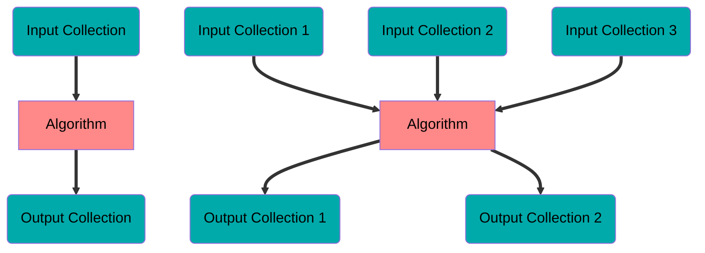
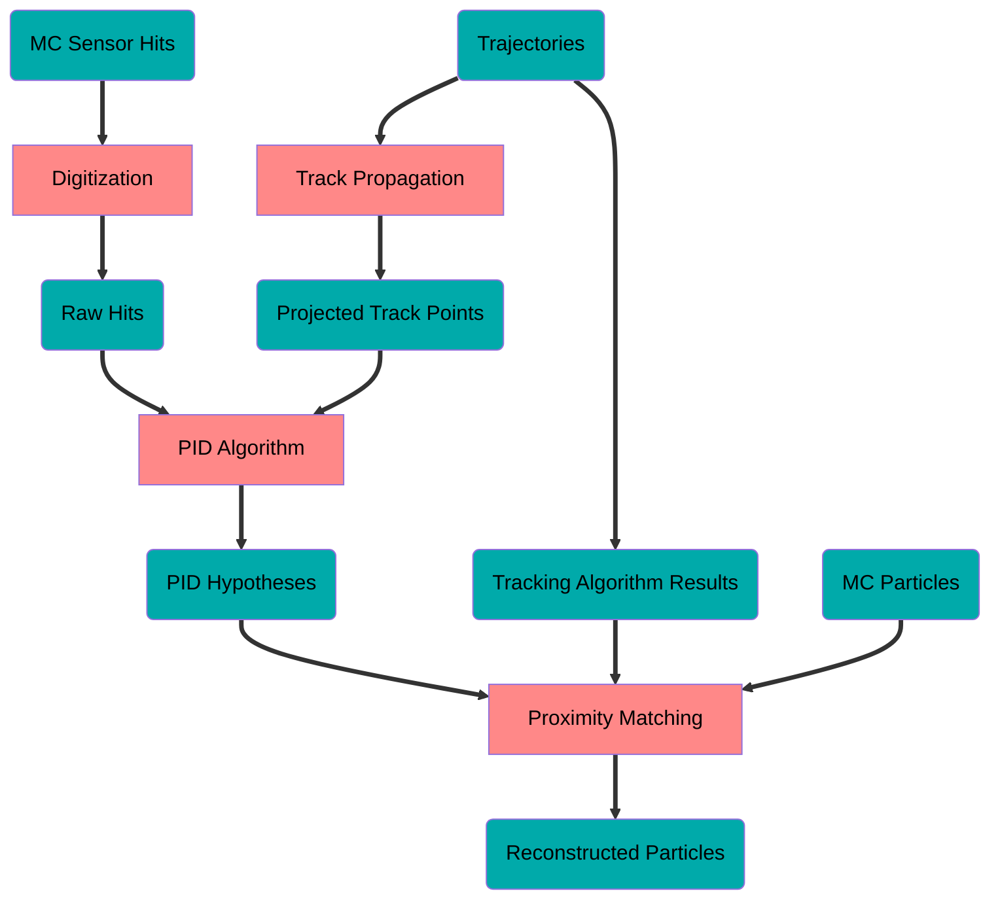

Tutorial 3: Running Reconstruction and Benchmarks
=================================================

- TUTORIAL RECORDING
- [Return to Tutorial Landing Page](README.md)

## Prerequisites
Before attending this tutorial, please build the reconstruction and benchmarks software, since this may take some time; this section describes how to do so.

### Obtaining the Software

At the time of writing this tutorial, dRICH PID is still not fully approved in the `main` branches of the reconstruction and benchmarks software. The current development branch is `irt-algo` for both; `irt-algo` on EICrecon is somewhat unstable, so instead I recommend you to use `irt-algo-stable`, which at times may be a bit behind `irt-algo`.

If you already have clones of `EICrecon` and `reconstruction_benchmarks`, you can switch branches by running the commands below. Most likely you have a clone of `EICrecon` (on branch `main`), but do not have a clone of `reconstruction_benchmarks` (clone commands are also given below)

- `EICrecon`:
```bash
pushd EICrecon
git fetch origin
git checkout irt-algo-stable    # or irt-algo, if you want bleeding edge
popd
```
- `reconstruction_benchmarks`:
```bash
pushd reconstruction_benchmarks
git fetch origin
git checkout irt-algo    # no irt-algo-stable branch, since this code doesn't change as rapidly
popd
```

Otherwise if you do not yet have clones of `EICrecon` and `reconstruction_benchmarks`, you can clone and checkout the appropriate branch in one command. As in [tutorial 1](1-setup-and-running-simulations.md), use HTTPS or SSH depending on your access credentials:

- `EICrecon` SSH:
```bash
git clone git@github.com:eic/EICrecon.git --branch irt-algo-stable       # or irt-algo, if you want bleeding edge
```
- `EICrecon` HTTPS:
```bash
git clone https://github.com/eic/EICrecon.git --branch irt-algo-stable   # or irt-algo, if you want bleeding edge
```
- `reconstruction_benchmarks` SSH:
```bash
git clone git@eicweb.phy.anl.gov:EIC/benchmarks/reconstruction_benchmarks.git --branch irt-algo
```
- `reconstruction_benchmarks` HTTPS:
```bash
git clone https://eicweb.phy.anl.gov/EIC/benchmarks/reconstruction_benchmarks.git --branch irt-algo
```

Verify that you are on the correct set of branches by running `./check_branches.sh`. The output should look something like:
```
                     drich-dev: main  (269bf3c)
                          epic: main  (d14e80b)
                       EDM4eic: NOT INSTALLED
                           irt: NOT INSTALLED
                      EICrecon: irt-algo-stable  (21fd271a)
                       juggler: NOT INSTALLED
     reconstruction_benchmarks: irt-algo  (d1c7885)
```
(the commit hashes, in parentheses, may differ)

### Building

Before anything, don't forget to be in an `eic-shell` container and to run `source environ.sh`.

#### Revert the Geometry

If you followed the previous tutorials, your `epic` repository may be in a non-default state. You can check this with either `./check_status.sh`, which runs `git status` on all repositories, or `cd epic` then run `git status`. If you see you have made changes, run `git diff` to show them. Revert your changes, if there are any.

Regardless of whether you made any changes in `epic` or not, it is recommended to rebuild `epic` in case you forgot that you made changes and have a modified build. Run `build.sh epic` (or your preferred `cmake` commands) to rebuild.

#### Build Reconstruction and Benchmarks

Now build the reconstruction and benchmarks code. You can use `build.sh` (see [tutorial 1](1-setup-and-running-simulations.md)) or your preferred `cmake` commands. If using `build.sh`, run the commands below. This will take some time; consider reducing the environment variable `BUILD_NPROC` so that the compilation does not use too many resources.
```bash
build.sh EICrecon
build.sh reconstruction_benchmarks
```
or just run:
```bash
rebuild_all.sh
```

Now you are ready to follow along with the interactive tutorial!

## dRICH Reconstruction Flowchart

The reconstruction requires two ingredients:
- **Collections**: a set of objects, such as dRICH sensor hits or PID results
- **Algorithms**: a transformation of a set of collections to another set of collections, such as a PID algorithm which transforms digitized hits and projected tracks into PID hypotheses



Both **Collections** and **Algorithms** are supposed to be (as) independent (as possible) from the underlying simulation and reconstruction frameworks; this follows the modularity paradigm, where pieces of ePIC software are as mutually orthogonal as possible.

The [EICrecon reconstruction framework](https://github.com/eic/EICrecon) is responsible for running these algorithms and handling the input and output collections. Using **Collections** and **Algorithms**, the full reconstruction forms a [Directed Acyclic Graph (DAG)](https://en.wikipedia.org/wiki/Directed_acyclic_graph), starting with Collections produced from DD4hep and ending with the final Collections requested by the user. Here we will call this DAG the "reconstruction flowchart."

**Important**: only the Collections which the user asks to be produced will be saved in the final reconstruction output; only the minimal set of algorithms will be executed such that all of the requested output collections are produced. In other words, the part of the reconstruction flowchart which is actually used depends on the requested output collections.

The default [set of output collections is found here](https://github.com/eic/EICrecon/blob/main/src/services/io/podio/JEventProcessorPODIO.cc). At the time of writing this tutorial, no dRICH output collections are included by default, therefore the dRICH PID does not yet run in the full production.

The reconstruction flowchart for the [dRICH PID is found here](https://github.com/eic/EICrecon/blob/main/src/detectors/DRICH/README.md). At the time of writing this tutorial, the general idea is:

- Transform the collection of MC dRICH sensor hits to digitized raw hits, using the digitization algorithm
- Transform the CKF trajectories into projected tracks in the dRICH radiator, using the track propagation algorithm
- Transform the digitized hits and projected tracks into PID hypotheses, using Indirect Ray Tracing
- Link the PID hypotheses to final reconstructed particles, using proximity matching




## Running the Full Stack

Now let's run the full stack:
- Simulation
- Reconstruction
- Benchmarks

### Simulation

For details how to run simulation, [see tutorial 1](1-setup-and-running-simulations.md). Run a simulation of your choice; here are some examples (for the version of `simulate.py` as of the interactive tutorial):

- throw 50 pions at the default fixed momentum:
```bash
simulate.py -t1 -n50
```

- throw 50 kaons at the default fixed momentum:
```bash
simulate.py -t1 -n50 -pkaon+
```

- throw 20 pions at 3 different angles:
```bash
simulate.py -t4 -n20 -k3
```

- throw 20 pions with 3 momentum values in the momentum range suitable for aerogel:
```bash
simulate.py -t7 -n20 -k3
```
or gas:
```bash
simulate.py -t8 -n20 -k3
```

Note that there are new simulation tests that will be added soon, such as those
which randomly vary the azimuthal angle. These example commands may differ in later
versions of `simulate.py`; run `simulate.py` for a full usage guide

### Reconstruction

Now that we have some simulated data, let's run the reconstruction.

At the time of writing this tutorial, we are in the middle of a re-design in the framework of how to handle configuration parameters. Currently all of our dRICH-specific configuration parameters are [hard-coded in DRICH.cc](https://github.com/eic/EICrecon/blob/5c330b91d6b837635b1607ae95e8758c216b426c/src/detectors/DRICH/DRICH.cc); all of these can be overridden by `eicrecon` commands in the form of `-Pparameter=value`.

To learn how to use `eicrecon`, see the [corresponding general tutorial](https://indico.bnl.gov/event/16833/). This dRICH tutorial will show you how to use our custom `eicrecon` wrapper, `recon.rb`.

It is envisioned that we will move to some sort of configuration file in the future, but that capability does not yet exist in EICrecon. Since such a feature is useful for us to have now, we have a wrapper of `eicrecon` here in `drich-dev`, called `recon.rb`, which:
- reads configuration files in the [`config/`](../../config) directory
- generates an `eicrecon` command, converting the configuration tree into a set of `-Pparameter=value` options
- runs `eicrecon` with these options

`recon.rb` allows us to quickly change the configuration without rebuilding EICrecon, and allows us to have, for example, one configuration with SiPM noise enabled and another with it disabled.

To get started, check the usage guide by running
```bash
recon.rb -h
```

_Exercise_: View the files in the [`config/`](../../config) directory, in particular, the default one; compare the settings to other configuration files in that directory. 

_Exercise_: Notice in the default configuration file the output collections, under `podio:output_include_collections:`. Can you find all of these collections in the dRICH reconstruction flowchart?

_Exercise_: Run a "dry-run" of `recon.rb`, which will just print the `eicrecon` command it will run; notice the relation between configuration parameters in the configuration file, the `-Pparameter=value` options in the `eicrecon` command, and the corresponding (default) parameters that are set in the EICrecon code itself.

To run the reconstruction on your sample simulation file (assuming you have the default file name), just run with no options:
```bash
recon.rb
```

If successful, you will find the output file (default name)
```bash
out/rec.edm4hep.root
```
If you open this file in `ROOT`, you will find an `events` tree, similar to what was produced from the simulation. If you include the collections from the simulation level in the reconstruction output, you will find the corresponding branches included here. Let's draw some distributions:

- Digitization:
```cpp
events->Draw("DRICHRawHits.cellID")     // distribution of SiPM pixel ID
events->Draw("DRICHRawHits.charge")     // ADC distribution
events->Draw("DRICHRawHits.timeStamp")  // TDC distribution
```

- Track Projections:
```cpp
events->Draw("DRICHAerogelTracks_0.position.z")   // z position of projected track points in aerogel
events->Draw("DRICHMergedTracks_0.position.x:DRICHMergedTracks_0.position.z")       // top-view of the projected track points in both radiators
events->Draw("DRICHGasTracks_0.position.x:DRICHGasTracks_0.position.z","","*same")  // draw the gas points on top, with larger markers
```

- Cherenkov PID (for gas; for aerogel change `Gas` to `Aerogel`)
```cpp
events->Draw("DRICHGasIrtCherenkovParticleID.npe")           // number of photoelectrons for each charged particle
events->Draw("DRICHGasIrtCherenkovParticleID.photonEnergy")  // average photon energy for each charged particle

// PID hypothesis weight for each PDG, for the 3rd charged particle (3rd event, if using particle gun):
events->Draw("DRICHGasIrtCherenkovParticleID_0.PDG","DRICHGasIrtCherenkovParticleID_0.weight","barhist",1,3)
```

Take a look at the list of branches. Notice that some of them are repeated, with suffixes such as `#0` or `_0`; this is because these branches are produced from [PODIO](https://github.com/AIDASoft/podio) using the [EDM4hep](https://github.com/key4hep/EDM4hep) and [EDM4eic](https://github.com/eic/EDM4eic) data models. We will cover more of this in [tutorial 4](4-reconstruction-code-part-1.md). While it is certainly possible to do an analysis using typical `ROOT` tools, you will gain a _significant_ advantage by using PODIO tools, since that will provide much simpler access to all of the data in the `TTree`, along with the relations between the data, such as a reconstructed particle and its relation to the set of PID hypotheses.

### Aside: Event Display and Noise Injection

Recall that our dRICH-specific `event_display` program can handle input from reconstruction output. Let's take a look:
```bash
event_display d s out/sim.edm4hep.root    # event display on the simulated data (pre-digitization, quantum efficiency, and safety factor)
event_display d r out/rec.edm4hep.root    # event display on the reconstructed data (post-digitization)
```
Notice there are significantly fewer hits after digitization

Now re-run the reconstruction, turning on the noise, and be sure to produce a differently named output file
```bash
recon.rb -c config/recon_irt_noise.yaml -r out/rec.noise.edm4hep.root
```
At the time of writing this, the IRT usage is not really capable of handling the noise, but we can still take a look at the event display:
```bash
event_display d r out/rec.noise.edm4hep.root
```
This is the noise from all of the events; see `event_display` usage guide to see the noise for each event individually.


## Benchmarks

Between the time of announcing this interactive tutorial and the interactive tutorial itself, there have been some updates to the benchmarks. To get these updates, pull them and recompile:
```bash
pushd reconstruction_benchmarks
git pull
popd
build.sh reconstruction_benchmarks
```

The benchmarks are meant to be executable by single commands, such that they can be easily called in the CI; the command should return a nonzero exit code upon failure. It is up to subsystem experts to check the artifacts, to ensure things like subsystem performance is adequate.

The dRICH benchmarks produce several plots, similar to the ones we were producing above. They make use of the PODIO tools in order to read the reconstruction data.

The primary command for dRICH benchmarks is symbolically linked in `drich-dev`:
```bash
ls -l benchmark.rb
# result: benchmark.rb -> reconstruction_benchmarks/benchmarks/rich/run_benchmark.rb
```

To run the benchmarks:
```bash
benchmark.rb     # print the usage guide
benchmark.rb -b  # run the benchmarks on out/rec.edm4eic.root
```
The following files will be produced (default names):
- `out/ana.edm4hep.root`: ROOT file with the plots
- `out/ana.plots/`: directory of plot images

