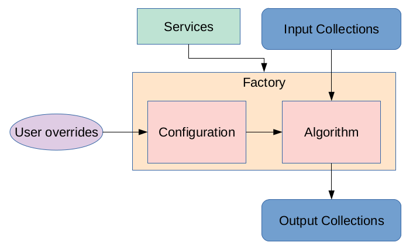

Tutorial 4: Reconstruction Code Part I
======================================

- [TUTORIAL RECORDING (mirror 1)](https://drive.google.com/file/d/1AtZWrKtmR5mimze8WsnN1wVJ72U_Ewdu/view?usp=sharing)
  -- [CHAT](https://drive.google.com/file/d/1YHoNTOO6zhZ0K9nBs2oYEI3M0Z-5rJVe/view?usp=sharing)
- [TUTORIAL RECORDING (mirror 2)](https://duke.zoom.us/rec/share/eJqawysxW9cb376hZE5Yth6hSyfWh_gvTGezb1ggnngZf84fm8oBW63So1dIr0lU.FDHkKc0ETS8TCYFO)
- [Return to Tutorial Landing Page](README.md)

## Introduction

Now we turn to discussing how the reconstruction code works. The reconstruction framework is [EICrecon](https://github.com/eic/EICrecon), based on [JANA2](https://github.com/JeffersonLab/JANA2). This version of the tutorial assumes the reconstruction algorithms are a part of EICrecon (there is a plan to separate the algorithms from the framework).

For an introduction to EICrecon and JANA2, see [the general tutorial](https://indico.bnl.gov/event/16833/).

### Data Model

To permit communication of data between the various ePIC software repositories, they must all agree on a data model, which expresses how the data are stored. We use the following data models, called Event Data Models (EDMs):

- [EDM4hep](https://github.com/key4hep/EDM4hep): a general data model used by many HEP experiments, including ePIC
- [EDM4eic](https://github.com/eic/EDM4eic): an extension of EDM4hep, with datatypes and components specific to ePIC

Within these repositories, there is a specification of the datatypes and components, in a YAML file. Before checking these files, here are some definitions you should know:

- **components**: an object that is used or part of a **datatype**, such as a 3D vector or a covariance matrix
- **datatype**: definition of some object, such as a sensor hit or a PID hypothesis; a **datatype** may have:
  - **Members**: scalar objects, typically integers, floating-point numbers or **components**
  - **VectorMembers**: vector objects, a list of scalars with a common type
  - **OneToOneRelations**: a bijective connection between objects; for example, a relation between a PID hypothesis and the charged particle it applies to
  - **OneToManyRelations**: a one-to-many connection between objects; for example, a relation between a reconstructed particle and the corresponding set of PID hypotheses
- **Associations**: these are special **datatypes**, typically used to relate MC-truth objects to reconstructed objects; their only members are typically **OneToOneRelations** and **OneToManyRelations**. For example, a relation between an MC particle and reconstructed particle contains two **OneToOneRelations**: one to the MC particle and the other to the reconstructed particle

Now take a look at the YAML files. Here are links to them, along with the various **datatypes** that are relevant for the dRICH:

- [edm4hep.yaml](https://github.com/key4hep/EDM4hep/blob/master/edm4hep.yaml)
  - `edm4hep::SimTrackerHit`: MC-truth dRICH sensor hits (recall that the dRICH is a (optical) "tracker" in DD4hep)
  - `edm4hep::MCParticle`: MC-truth particle
  - `edm4hep::ParticleID`: a PID hypothesis result; these are the user-level PID objects that the dRICH PID algorithms produces
  - `edm4hep::ReconstructedParticle`: a reconstructed particle (we do not yet use this in ePIC; instead we use a modified version in EDM4eic)
- [edm4eic.yaml](https://github.com/eic/EDM4eic/blob/main/edm4eic.yaml)
  - `edm4eic::RawTrackerHit`: a digitized dRICH sensor hit
  - `edm4eic::TrackSegment`: a segment of a full track, consisting of a list of `edm4eic::TrackPoint` component objects
  - `edm4eic::CherenkovParticleID`: expert-level PID object for Cherenkov detectors; it contains a list of hypotheses, `edm4eic::CherenkovParticleIDHypothesis` component objects, one for each mass hypothesis
  - `edm4eic::ReconstructedParticle`: a reconstructed particle
  - `edm4eic::MCRecoParticleAssociation`: an association between a reconstructed particle and the corresponding MC-truth particle
  - `edm4eic::MCRecoTrackerHitAssociation`: an association between a digitized hit and the corresponding set of MC-truth hits

Being a YAML file, this expression of the data model is independent of any programming language. Code generation may be used to generate an API to use the data model in any preferred language. In ePIC, we use [PODIO](https://github.com/AIDASoft/podio) to generate C++ classes from these YAML files. You can find full documentation linked in the EDM Github repositories; alternatively, browse the C++ header files in `eic-shell` found in:
```bash
/usr/local/include/edm4hep
/usr/local/include/edm4eic
```

See also [Thomas Madlener's CHEP 2023 talk](https://indico.jlab.org/event/459/contributions/11578/) for another resource on PODIO.

One last definition before discussing algorithms: for each **datatype**, you will find a **Collection**, which is a set of objects of a particular **datatype**. These **Collections** are the primary object passed between reconstruction algorithms and other ePIC software packages.

### Algorithms

An algorithm is a transformation from one set of EDM Collections to another; for example, a digitizer transforms a collection of MC-truth sensor hits to a collection of raw, digitized hits (and in our dRICH usage, an additional collection of associations between the raw hits and MC hits).

IMPORTANT: these algorithms are supposed to be _as independent as possible_ from the reconstruction framework; the primary dependence should be on the data model. Eventually we may fully decouple the algorithms from EICrecon, but for now they currently live in the EICrecon repository. See [Sylvester's CHEP 2023 talk](https://indico.jlab.org/event/459/contributions/11419/) for more details.

Algorithms should be:
- Configurable, allowing external configuration to tune for specific subsystems or use cases
- Focused, not trying to do too many things
- Shareable, since some algorithms may be useful for multiple subsystems
- Modular, independent from other algorithms and from EICrecon

Algorithms are typically a class, with the following methods:
- `AlgorithmInit`: run once, before all events
- `AlgorithmProcess`: run on each event, returning a set of output collections given a set of input collections

An additional class (or `struct`) is used to hold the set of configuration parameters for an algorithm. The algorithm (or its base class) typically owns an instance of its configuration class.

We are now ready to discuss [the dRICH reconstruction flowchart of algorithms](https://github.com/eic/EICrecon/blob/main/src/detectors/DRICH/README.md).

See also [slides on dRICH algorithms](https://indico.bnl.gov/event/19683/attachments/48044/82398/slides.pdf) for a general idea of what each algorithm does.

## EICrecon

### Definitions

[EICrecon](https://github.com/eic/EICrecon) is used to run the reconstruction algorithms. It is there that the connections between collections and algorithms are defined. To proceed, we need a few more definitions:

- **Factory**: a factory uses an algorithm to produce a set of output collections, given input collections
  - this is effectively the EICrecon-dependent part of an algorithm, though it is a _separate_ class, since we prefer the algorithm _itself_ to be EICrecon independent
  - interfaces algorithm configuration with the user (`eicrecon` command)
  - initializes an algorithm, given the configuration
  - handles the input and output data of an algorithm, running the algorithm's `AlgorithmProcess` method
- **Service**: globally common features, including:
  - access to the detector geometry
    - NOTE: the RICH detectors have an extended geometry service, called `richgeo`, which serves the dRICH geometry in the form of ACTS surfaces for track propagation and IRT optical surfaces for the IRT PID, along with additional geometry-related features
  - logging and log levels
  - file I/O
- **Plugin**:
  - runs the factories
  - effectively expresses the "wiring" between algorithms and collections

Here is a visual representation:



### Code Organization

At the time of writing this tutorial, the part of the source code tree relevant for the dRICH is given below. Notice that the algorithm and factory names are given in the dRICH algorithm flowchart, but here we show the full file tree so that you can more easily find the relevant files.
```
src
├── algorithms   // EICrecon-independent algorithms (cf. factories in global/ below)
│   │
│   ├── digi
│   │   ├── PhotoMultiplierHitDigi.cc       // digitizer
│   │   ├── PhotoMultiplierHitDigi.h
│   │   └── PhotoMultiplierHitDigiConfig.h
│   │
│   ├── tracking
│   │   ├── TrackPropagation.cc             // propagate tracks to surfaces
│   │   └── TrackPropagation.h
│   │
│   └── pid
│       │
│       ├── MergeTracks.cc                  // combine propagated track segments
│       ├── MergeTracks.h
│       │
│       ├── IrtCherenkovParticleID.cc       // run the underlying Indirect Ray Tracing (IRT) algorithm
│       ├── IrtCherenkovParticleID.h
│       ├── IrtCherenkovParticleIDConfig.h
│       │
│       ├── MergeParticleID.cc              // combine ParticleID objects
│       ├── MergeParticleID.h
│       ├── MergeParticleIDConfig.h
│       │
│       ├── ParticlesWithPID.cc             // link reconstructed particles to ParticleID objects
│       ├── ParticlesWithPID.h
│       ├── ParticlesWithPIDConfig.h
│       │
│       ├── ConvertParticleID.h             // conversions between different ParticleID datatypes
│       └── Tools.h                         // common methods and constants
│
│
├── detectors   // plugins for each detector subsystem
│   └── DRICH
│       ├── DRICH.cc    // DRICH plugin: "wiring" of dRICH reconstruction algorithms, factories, and collections
│       └── README.md   // primary documentation for dRICH reconstruction
│
│
├── global   // EICrecon factories (each corresponds to an algorithm above)
│   │
│   ├── digi
│   │   ├── PhotoMultiplierHitDigi_factory.cc
│   │   └── PhotoMultiplierHitDigi_factory.h
│   │
│   └── pid
│       ├── pid.cc  // the PID plugin (uses DRICH plugin results, and eventually will use other PID subsystem results too)
│       │
│       ├── IrtCherenkovParticleID_factory.cc
│       ├── IrtCherenkovParticleID_factory.h
│       │
│       ├── MergeCherenkovParticleID_factory.cc
│       ├── MergeCherenkovParticleID_factory.h
│       │
│       ├── MergeTrack_factory.cc
│       ├── MergeTrack_factory.h
│       │
│       ├── ParticlesWithPID_factory.cc
│       ├── ParticlesWithPID_factory.h
│       │
│       ├── RichTrackConfig.h     // TODO: this should be converted to an algorithm configuration...
│       ├── RichTrack_factory.cc
│       └── RichTrack_factory.h
│
│
├── services      // EICrecon services
│   └── geometry
│       └── richgeo    // RICH geometry bindings
│           │
│           ├── richgeo.cc          // plugin and service implementation
│           ├── RichGeo_service.cc
│           ├── RichGeo_service.h
│           │
│           ├── ActsGeo.cc          // bindings to ACTS, for track propagation
│           ├── ActsGeo.h
│           │
│           ├── IrtGeo.cc           // bindings to IRT, for PID optics
│           ├── IrtGeo.h
│           ├── IrtGeoDRICH.cc
│           ├── IrtGeoDRICH.h
│           ├── IrtGeoPFRICH.cc
│           ├── IrtGeoPFRICH.h
│           │
│           ├── ReadoutGeo.cc       // information about the readout geometry and pixels
│           ├── ReadoutGeo.h
│           │
│           └── RichGeo.h           // common objects and functions
│
│
└── tests
    └── algorithms_test          // unit tests
        ├── pid_MergeTracks.cc
        └── pid_MergeParticleID.cc
```

We will now give a tour of the code; the remainder of this tutorial is contained in the tutorial recording, linked at the top of this page.
